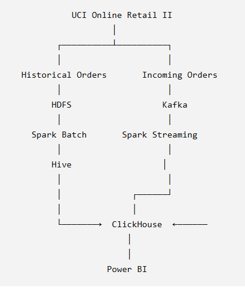
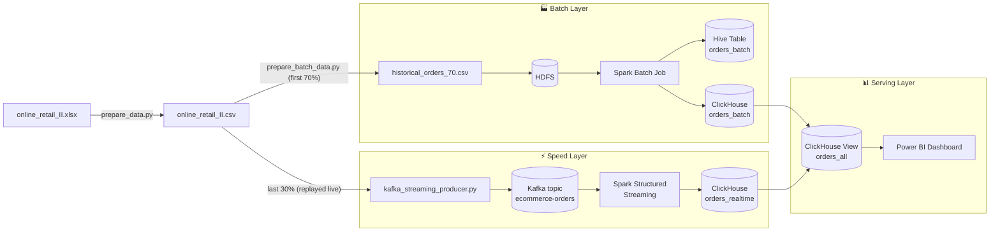
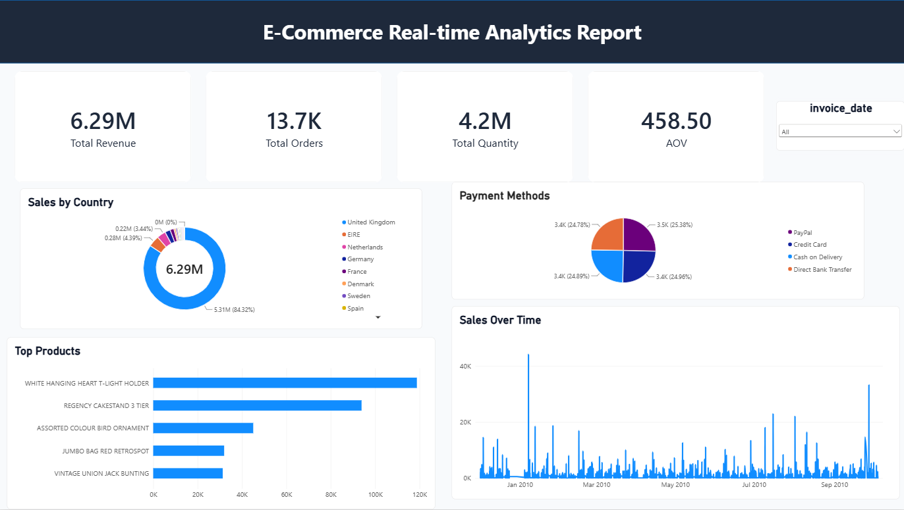

# 🛒 E-Commerce Data Pipeline — Lambda Architecture (Kafka • Spark • Hadoop • Hive • ClickHouse • Power BI)

An end-to-end **Lambda Architecture** data platform that ingests, cleans, and serves e-commerce order data through both a **batch path** (historical data) and a **real-time streaming path** (live orders), unifying both in **ClickHouse** for analytics in **Power BI**.

Built on the [Online Retail II](https://archive.ics.uci.edu/dataset/502/online+retail+ii) dataset (UK-based online retailer transactions), split chronologically to simulate a real production scenario: the first 70% of orders are treated as "historical" data, and the last 30% are replayed through Kafka to simulate live incoming orders.

---

## 📖 Table of Contents

- [Architecture](#-architecture)
- [Tech Stack](#-tech-stack)
- [Project Structure](#-project-structure)
- [Data Flow](#-data-flow)
- [Database Schema](#-database-schema)
- [Getting Started](#-getting-started)
- [Configuration](#-configuration)
- [Power BI Dashboard](#-power-bi-dashboard)
- [Data Cleaning & Enrichment Logic](#-data-cleaning--enrichment-logic)
- [Future Improvements](#-future-improvements)
- [License](#-license)

---

## 🏗️ Architecture





The pipeline follows the classic **Lambda Architecture** pattern:

| Layer | Purpose | Components |
|---|---|---|
| **Batch layer** | Accurate, complete view of historical data | HDFS → Spark batch job → Hive → ClickHouse |
| **Speed layer** | Low-latency view of the most recent orders | Kafka → Spark Structured Streaming → ClickHouse |
| **Serving layer** | Unified query surface for consumers | ClickHouse `orders_all` view → Power BI |

---

## 🧰 Tech Stack

| Component | Role |
|---|---|
| **Apache Kafka (KRaft mode)** | Message broker simulating live incoming orders |
| **Apache Spark 3.5.3** | Batch ETL + Structured Streaming engine |
| **Hadoop HDFS** | Distributed storage for raw historical data |
| **Hive Metastore** | Table/schema catalog for the batch dataset |
| **ClickHouse 24.8** | Columnar OLAP store serving both batch & real-time data |
| **Power BI** | Business intelligence dashboard on top of ClickHouse |
| **Docker Compose** | Orchestrates the entire local stack |

---

## 📁 Project Structure

```
ecommerce-kafka-ingestion/
├── clickhouse_init/
│   └── 01_create_tables.sql          # ClickHouse schema: orders_batch, orders_realtime, orders_all view
├── spark_jobs/
│   ├── spark_batch_to_hive_clickhouse.py   # Batch: HDFS → clean/enrich → Hive → ClickHouse
│   └── streaming_to_clickhouse.py          # Streaming: Kafka → clean/filter → ClickHouse
├── docker-compose.yml                 # Kafka, ClickHouse, Spark, HDFS (namenode/datanode), Hive metastore
├── retail_common.py                   # Shared cleaning/category/payment logic (pandas + PySpark)
├── prepare_data.py                    # Converts the raw .xlsx dataset to .csv
├── prepare_batch_data.py              # Splits data 70/30 by time, uploads batch slice to HDFS
├── kafka_streaming_producer.py        # Replays the remaining 30% of orders onto Kafka
├── online_retail_II.xlsx / .csv       # Source dataset
├── historical_orders_70.csv           # Generated batch slice (fed to HDFS)
├── ecommerce_pipeline_presentation.pptx
├── lambda_architecture_diagram.png
├── Powerbi_dashboard.png
└── requirements.txt
```

---

## 🔄 Data Flow

### 1. Batch layer — historical data (first 70%, by `InvoiceDate`)

1. `prepare_data.py` converts the original `online_retail_II.xlsx` into `online_retail_II.csv`.
2. `prepare_batch_data.py` sorts orders by timestamp, cuts the first 70% into `historical_orders_70.csv`, and uploads it to HDFS (`/user/hadoop/raw_batch/`).
3. `spark_jobs/spark_batch_to_hive_clickhouse.py`:
   - Reads the raw CSV from HDFS.
   - Cleans it (drops cancelled invoices, nulls, invalid prices/quantities, malformed stock codes).
   - Enriches each row with a **category** (keyword-based classification) and a **payment method** (deterministic hash, see below).
   - Writes the result as a managed **Parquet Hive table** (`ecommerce.orders_batch`), partitioned by month.
   - Pushes the same rows into **ClickHouse** (`ecommerce.orders_batch`) via the HTTP interface (`INSERT ... FORMAT JSONEachRow`, one batch per Spark partition).
   - Verifies the row counts in Spark and ClickHouse match before declaring success.

### 2. Speed layer — real-time data (last 30%)

1. `kafka_streaming_producer.py` replays the remaining 30% of orders (in original chronological order) onto the Kafka topic `ecommerce-orders`, one JSON message per order, stamped with a live `event_time`.
2. `spark_jobs/streaming_to_clickhouse.py` (Spark Structured Streaming):
   - Subscribes to the Kafka topic.
   - Parses and validates each message.
   - Writes each micro-batch (5-second trigger) straight into ClickHouse `ecommerce.orders_realtime`.

### 3. Serving layer

The ClickHouse view `ecommerce.orders_all` does a `UNION ALL` of `orders_batch` and `orders_realtime`, tagging each row with its `source` (`batch` / `stream`). **Power BI** connects to this view (or the individual tables) for a single, always-current picture of the business.

---

## 🗄️ Database Schema

Defined in [`clickhouse_init/01_create_tables.sql`](clickhouse_init/01_create_tables.sql) and auto-executed on first ClickHouse startup (mounted into `/docker-entrypoint-initdb.d`):

| Table | Engine | Purpose |
|---|---|---|
| `ecommerce.orders_batch` | `MergeTree`, partitioned by month, ordered by `(invoice_date, order_id)` | Historical orders from the batch pipeline |
| `ecommerce.orders_realtime` | `MergeTree`, ordered by `(event_time, order_id)` | Live orders from the streaming pipeline |
| `ecommerce.orders_all` (view) | `UNION ALL` of the two tables above | Unified read surface for BI tools |

Both fact tables share the same shape: `order_id, customer_id, stock_code, product_name, category, price, quantity, total_amount, country, payment_method, invoice_date` (+ `event_time` for the realtime table).

---

## ⚙️ Getting Started

### Prerequisites

- Docker & Docker Compose
- Python 3.9+ on the host (for the prep/producer scripts)
- ~4 GB free RAM for the stack (Kafka + Spark + Hadoop + Hive + ClickHouse)

### 1. Clone and install host-side dependencies

```bash
git clone <your-repo-url>
cd ecommerce-kafka-ingestion
pip install -r requirements.txt
```

### 2. Prepare the dataset

```bash
# xlsx -> csv
python prepare_data.py

# split into 70% batch / 30% streaming, save historical_orders_70.csv
python prepare_batch_data.py --file online_retail_II.csv --out historical_orders_70.csv
```

If the `hdfs` CLI isn't available on your host, the script prints the `docker cp` / `docker exec` commands to upload the file manually once the stack is up.

### 3. Start the stack

```bash
docker compose up -d
```

Give the Hadoop/Hive containers about a minute to finish initializing before submitting jobs.

### 4. Upload the batch file to HDFS (if not done automatically)

```bash
docker cp historical_orders_70.csv namenode:/tmp/historical_orders_70.csv
docker exec namenode hdfs dfs -mkdir -p /user/hadoop/raw_batch
docker exec namenode hdfs dfs -put -f /tmp/historical_orders_70.csv /user/hadoop/raw_batch/
```

### 5. Run the batch job

```bash
docker exec -it spark spark-submit \
  --master local[*] \
  spark_jobs/spark_batch_to_hive_clickhouse.py
```

### 6. Start the streaming job

```bash
docker exec -it spark spark-submit \
  --master local[*] \
  --packages org.apache.spark:spark-sql-kafka-0-10_2.12:3.5.3 \
  spark_jobs/streaming_to_clickhouse.py
```

### 7. Replay live orders into Kafka

```bash
python kafka_streaming_producer.py --file online_retail_II.csv --delay 0.2 --limit 2000
```

Use `--delay 0` to push everything as fast as possible, or `--limit` for a short demo run.

### 8. Query ClickHouse

```bash
curl "http://localhost:8123/?query=SELECT+count()+FROM+ecommerce.orders_all" \
  -H 'X-ClickHouse-User: admin' -H 'X-ClickHouse-Key: admin123'
```

### 9. Connect Power BI

Point Power BI's ClickHouse connector (or the generic ODBC/HTTP connector) at `http://localhost:8123`, database `ecommerce`, and build visuals on top of `orders_all`.

---

## 🔧 Configuration

All jobs read their configuration from environment variables (already wired up in `docker-compose.yml`):

| Variable | Used by | Default |
|---|---|---|
| `HDFS_URI` | batch job | `hdfs://namenode:9000` |
| `RAW_PATH` | batch job | `.../raw_batch/historical_orders_70.csv` |
| `HIVE_METASTORE_URI` | batch job | `thrift://hive-metastore:9083` |
| `HIVE_DB` / `HIVE_TABLE` | batch job | `ecommerce` / `orders_batch` |
| `CH_URL` | batch + streaming jobs | `http://clickhouse:8123` |
| `CH_USER` / `CH_PASSWORD` | batch + streaming jobs | `admin` / `admin123` |
| `KAFKA_BOOTSTRAP` / `KAFKA_TOPIC` | streaming job | `kafka:19092` / `ecommerce-orders` |
| `KAFKA_BROKER` | producer script | `localhost:9092` |

> ⚠️ Default credentials are for **local development only**. Replace them (and move secrets out of the compose file) before deploying anywhere shared.

---

## 📊 Power BI Dashboard



The dashboard reads from `ecommerce.orders_all`, giving a combined, near-real-time view of revenue, top categories, countries, and payment methods across both the historical and streaming data.

---

## 🧪 Data Cleaning & Enrichment Logic

All business rules live in a single shared module, [`retail_common.py`](retail_common.py), so the **pandas** side (producer, prep scripts) and the **PySpark** side (batch job) always apply identical logic:

- **Cleaning**: drop cancelled invoices (`Invoice` starting with `C`), null customers/descriptions, non-positive price/quantity, and malformed stock codes (must start with 5 digits).
- **Category classification**: keyword matching against the product description (`Lighting`, `Kitchenware`, `Office Supplies`, `Gifts`, defaulting to `Home Decor`).
- **Payment method**: the raw dataset has no payment field, so one is **deterministically simulated** from a CRC32 hash of the order ID, mapped onto `Credit Card / PayPal / Cash on Delivery / Direct Bank Transfer` — this keeps the value stable and reproducible across batch and streaming runs for the same order.
- **Batch/stream split**: `split_cutoff()` picks the timestamp at the 70th percentile of the sorted order timeline, so the historical and live slices never overlap.

---

## 🚀 Future Improvements

- [ ] Orchestrate batch runs with Airflow/Dagster instead of manual `spark-submit`
- [ ] Add schema evolution / a schema registry for the Kafka topic
- [ ] Exactly-once delivery guarantees into ClickHouse (currently at-least-once via HTTP inserts)
- [ ] Automated tests for `retail_common.py`'s cleaning/classification logic
- [ ] Replace hardcoded credentials with Docker secrets / `.env`
- [ ] Add monitoring (Kafka lag, Spark streaming metrics, ClickHouse query health)

---

## 📝 License

This project is licensed under the [MIT License](LICENSE).

## 🙌 Acknowledgements

- Dataset: [Online Retail II](https://archive.ics.uci.edu/dataset/502/online+retail+ii), UCI Machine Learning Repository.
